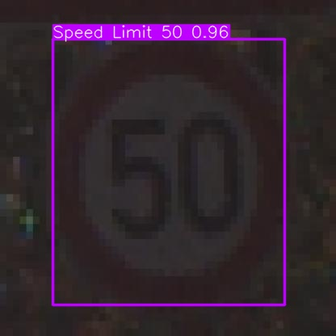
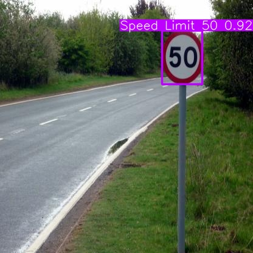
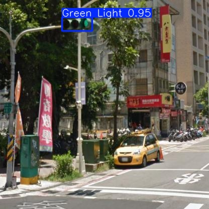
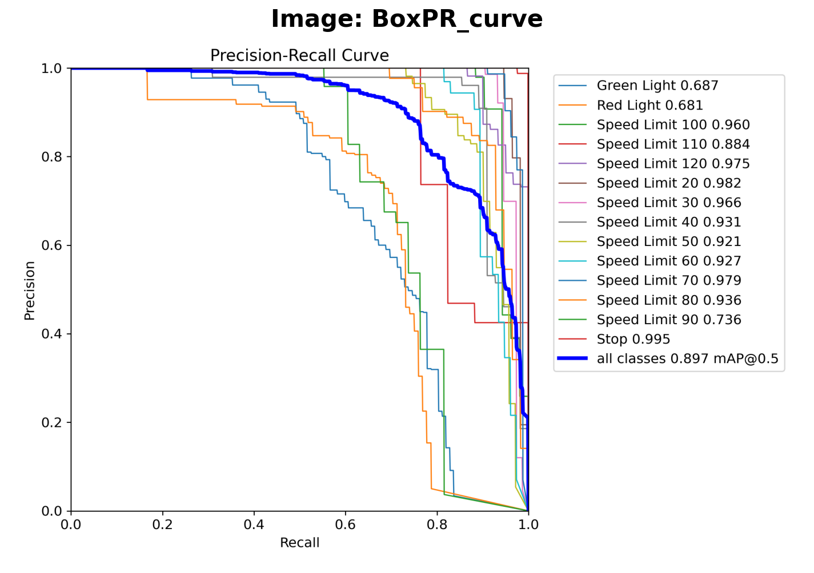
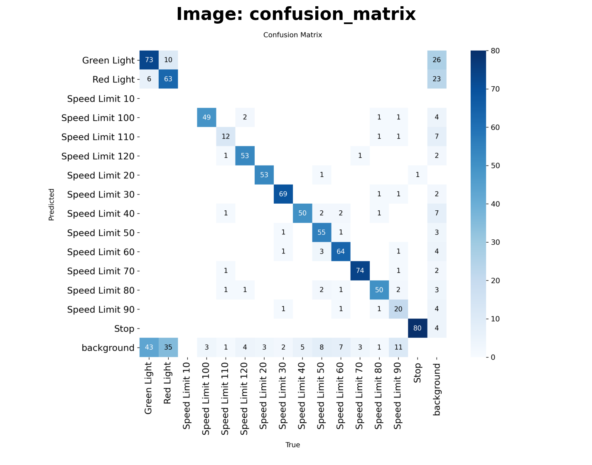

# 🚦 Traffic Sign Detection with YOLOv8

[](https://www.python.org/downloads/)
[](https://github.com/ultralytics/ultralytics)
[](LICENSE)
[](https://www.kaggle.com/datasets/pkdarabi/cardetection)

A real-time traffic sign detection system powered by YOLOv8, capable of identifying and localizing traffic signs with high accuracy. Perfect for autonomous driving applications and smart traffic management systems.

---


## 🖼️ Visual Results

### Detection Examples





### Training Progress


### Model Performance


---

## ✨ Key Features

- **State-of-the-art YOLOv8n** architecture for fast and accurate detection
- **Real-time inference** capability on edge devices
- **Comprehensive training pipeline** with data augmentation
- **Detailed performance metrics** and visualizations
- **ONNX export** for deployment flexibility
- **End-to-end workflow** from data loading to model deployment

---

## 📊 Performance Metrics

The model achieves strong performance on the traffic sign detection task:

| Metric | Score |
|--------|-------|
| **mAP@0.5** | High precision at IoU threshold 0.5 |
| **mAP@0.5:0.95** | Robust performance across IoU thresholds |
| **Precision** | Minimizes false positives |
| **Recall** | Effective at detecting all signs |

*Visual performance metrics and training curves are available in the notebook.*

---

## 🚀 Quick Start

### Prerequisites
```bash
pip install ultralytics opencv-python matplotlib seaborn pandas
```

### Dataset Setup
```bash
# Download the dataset from Kaggle
kaggle datasets download -d pkdarabi/cardetection
unzip cardetection.zip
```

### Training
```python
from ultralytics import YOLO

model = YOLO('yolov8n.pt')
results = model.train(
    data='path/to/data.yaml',
    epochs=10,
    imgsz=416,
    batch=32
)
```

---

## 📁 Project Structure

The notebook is organized into the following sections:

1. **Introduction** - Project overview and objectives
2. **Setup & Installation** - Environment configuration
3. **Data Exploration** - Dataset analysis and visualization
4. **Model Training** - YOLOv8 training with custom parameters
5. **Performance Evaluation** - Metrics calculation and visualization
6. **Model Inference** - Testing on new images
7. **Model Export** - ONNX conversion for deployment

---

## 🔧 Technical Details

### Model Architecture
- **Base Model**: YOLOv8n (Nano variant for efficiency)
- **Input Size**: 416×416 pixels
- **Framework**: Ultralytics YOLOv8

### Training Configuration
- **Optimizer**: Auto (AdamW)
- **Learning Rate**: 0.0001 (initial), with decay to 0.1
- **Batch Size**: 32
- **Epochs**: 10
- **Dropout**: 0.2 for regularization
- **Early Stopping**: Patience of 50 epochs

### Dataset
- **Source**: [Traffic Signs Detection](https://www.kaggle.com/datasets/pkdarabi/cardetection)
- **Format**: YOLO format (class_id, x_center, y_center, width, height)
- **Split**: Train/Validation/Test sets

---

## 🎯 Use Cases

- **Autonomous Vehicles**: Real-time sign recognition for self-driving cars
- **Traffic Monitoring**: Automated traffic sign inventory and maintenance
- **Driver Assistance**: ADAS systems for enhanced road safety
- **Smart City Infrastructure**: Intelligent traffic management systems

---

## 🔮 Future Improvements

-  Expand dataset with more traffic sign classes
-  Implement multi-class sign detection
-  Optimize for mobile deployment (TensorFlow Lite)
-  Add support for video stream processing
-  Integrate with GPS for context-aware detection
-  Deploy as a REST API service

---

## 📝 Notebook Contents

The Jupyter notebook (`Traffic_Sign_Detection.ipynb`) contains:
- Complete code implementation
- Detailed explanations and markdown documentation
- Visualization of training progress
- Performance metrics and evaluation graphs
- Sample predictions with bounding boxes

---

## 🛠️ Technologies Used

- **Deep Learning**: YOLOv8, PyTorch
- **Computer Vision**: OpenCV, PIL
- **Data Processing**: NumPy, Pandas
- **Visualization**: Matplotlib, Seaborn
- **Deployment**: ONNX Runtime

---

<div align="center">
  <strong>Built with ❤️ for safer roads</strong>
</div>